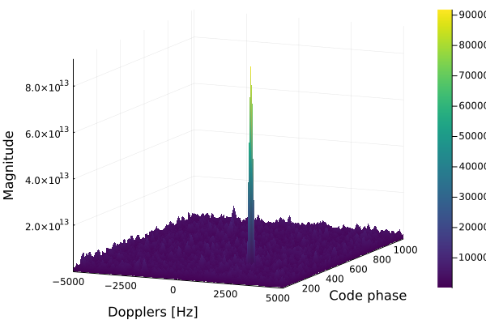

# Acquisition.jl

[](https://github.com/JuliaGNSS/Acquisition.jl/actions)
[](https://codecov.io/gh/JuliaGNSS/Acquisition.jl)
[](https://JuliaGNSS.github.io/Acquisition.jl/stable)
[](https://JuliaGNSS.github.io/Acquisition.jl/dev)

GNSS signal acquisition using parallel code phase search.

Part of the [JuliaGNSS](https://github.com/JuliaGNSS) ecosystem.

## Installation

```julia
using Pkg
Pkg.add("Acquisition")
```

## Quick Start

```julia
using Acquisition, GNSSSignals

# Acquire GPS L1 C/A signals
results = acquire(GPSL1(), signal, 5e6Hz, 1:32)

# Coarse-fine acquisition for better Doppler resolution
results = coarse_fine_acquire(GPSL1(), signal, 5e6Hz, 1:32)

# Plot results
using Plots
plot(results[1])
```



## Documentation

See the [documentation](https://JuliaGNSS.github.io/Acquisition.jl/stable) for detailed usage and API reference.

## License

MIT License
