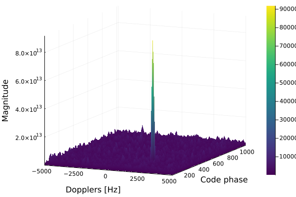

# Acquisition.jl

[](https://github.com/JuliaGNSS/Acquisition.jl/actions)
[](https://codecov.io/gh/JuliaGNSS/Acquisition.jl)
[](https://JuliaGNSS.github.io/Acquisition.jl/stable)
[](https://JuliaGNSS.github.io/Acquisition.jl/dev)

GNSS signal acquisition using the **FM-DBZP** (Frequency-domain Modified Double Block Zero Padding) algorithm (Heckler & Garrison, 2009).

Part of the [JuliaGNSS](https://github.com/JuliaGNSS) ecosystem. Works with [GNSSSignals.jl](https://github.com/JuliaGNSS/GNSSSignals.jl) for signal definitions.

## Features

- **FM-DBZP algorithm** — joint code-phase and Doppler search via a 2-D FFT structure; simultaneous correlation across all code phases and Doppler bins in a single pass
- **Pre-computed plans** — reuse FFT plans and pre-allocated buffers across acquisitions with `plan_acquire` / `acquire!` for zero-allocation hot paths
- **Multi-threaded** — PRNs processed in parallel automatically when Julia is started with multiple threads (`julia -t N`)
- **Non-coherent integration** — accumulate power across multiple signal segments to improve sensitivity at low CN0
- **Data bit handling** — bit-edge search and sign-combination search for coherent integration spanning GPS L1 C/A data bits
- **CFAR detection** — built-in constant false alarm rate threshold via `is_detected` / `cfar_threshold`
- **Sub-sample interpolation** — parabolic interpolation for Doppler and code-phase refinement below grid resolution
- **Plotting** — visualise correlation power surfaces directly with Plots.jl

## Installation

```julia
using Pkg
Pkg.add("Acquisition")
```

## Quick Start

```julia
using Acquisition, GNSSSignals
import Unitful: Hz

system = GPSL1()

# Generate a synthetic GPS L1 signal for PRN 1
(; signal, sampling_freq, interm_freq) = generate_test_signal(system, 1)

# Acquire PRNs 1–32
results = acquire(system, signal, sampling_freq, 1:32; interm_freq)

# Filter to detected satellites (CFAR, 1% false alarm probability)
detected = filter(is_detected, results)
```

### Reusing a Plan

For repeated acquisitions (e.g. processing a recorded file), pre-compute a plan once to avoid repeated FFT planning and memory allocation:

```julia
plan = plan_acquire(system, sampling_freq, collect(1:32))
results = acquire!(plan, signal, 1:32; interm_freq)
```

### Non-coherent Integration

At low CN0, accumulate power across multiple successive signal segments:

```julia
plan = plan_acquire(system, sampling_freq, [1];
    num_coherently_integrated_code_periods = 10,
    num_noncoherent_accumulations = 8)

results = acquire!(plan, long_signal, [1])
```

### Plotting

```julia
using Plots

result = acquire(system, signal, sampling_freq, 1;
    interm_freq, store_power_bins = true)
plot(result)
```



## Documentation

See the [documentation](https://JuliaGNSS.github.io/Acquisition.jl/stable) for the full usage guide, algorithm details, and API reference.

## License

MIT License
